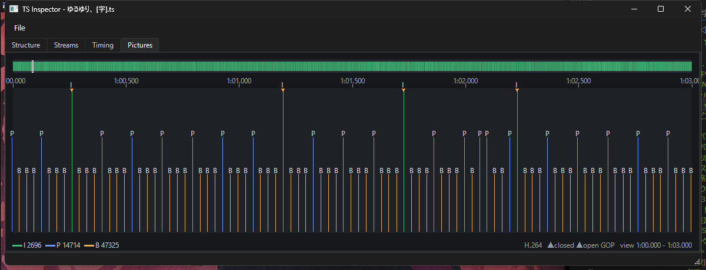
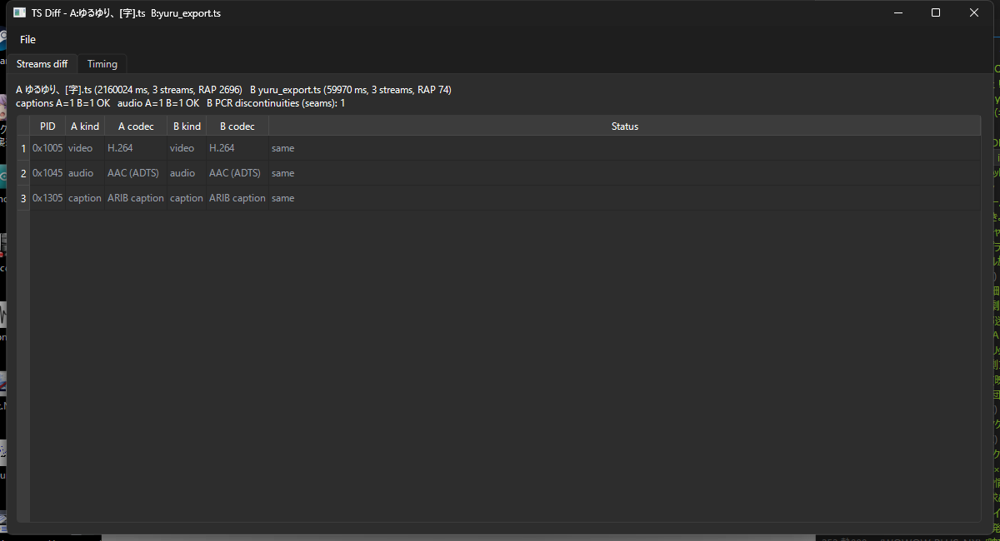
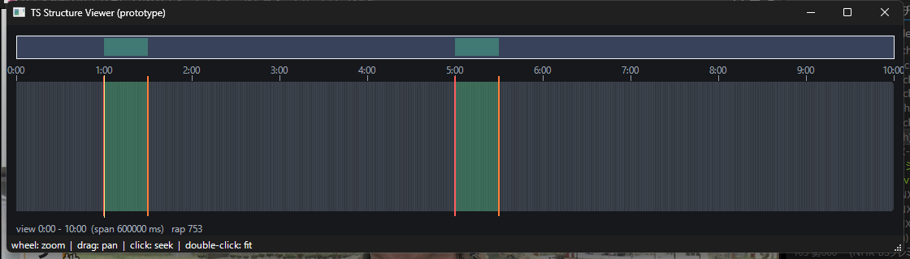
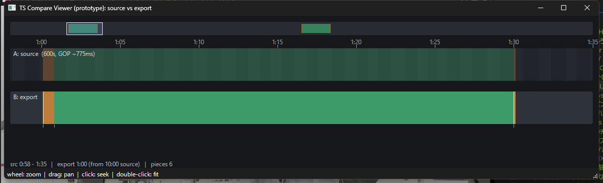

# ts-structure-viewer

Qt6/C++ viewers for inspecting **MPEG-2 TS** structure and verifying
**smart-rendering** (frame-accurate, mostly-lossless cut) exports. Companion to
the editor [`ts-edit-gui`](https://github.com/nanamitm/ts-edit-gui): when a cut
copies whole GOPs verbatim and only re-encodes the boundary GOPs, these tools
let you *see* what was copied, re-encoded, dropped or preserved.

Everything is built on a dependency-free (Qt-only) raw 188-byte TS parser
(`TsScan`) — no libav/ffmpeg — because a structure/verification tool wants the
packet-level PCR, CC, RAI and discontinuity flags a demuxer hides.

Four small executables:

| exe | what |
|-----|------|
| **`ts-inspector`** | open a real `.ts` → Structure (GOP/RAP), Streams (PSI), Timing (PTS/DTS/PCR), Pictures (I/P/B) |
| **`ts-diff`** | diff a source vs its export → did captions/audio survive? where are the seams? |
| `ts-structure-viewer` | the viewport structure widget with a smart-render plan overlay (synthetic data) |
| `ts-compare-viewer` | source-vs-export structure alignment (synthetic data) |






Requires Qt 6 (Widgets) and CMake; tested with MSVC on Windows.

## Controls
- **wheel** — zoom in/out, centered on the cursor
- **left-drag** — pan the visible range
- **left-click** — seek (emits `seekRequested`)
- **double-click** — fit the whole duration
- **click the minimap** — recenter the view there

## Layout
- **Minimap** (top): whole-program overview + the current view window box
- **Ruler**: time ticks for the visible range
- **Lane**: GOP bands (alternating shade), keyframe lines, and the plan overlay
  - green = copy region (verbatim passthrough)
  - orange = lead-in / tail partial-GOP re-encode windows
  - red / orange grips = segment IN / OUT

## Build
```powershell
$env:PATH="C:\Program Files\CMake\bin;"+$env:PATH
cmake -S . -B build-msvc -G "Visual Studio 17 2022" -A x64 `
      -DCMAKE_PREFIX_PATH=C:\Qt\6.11.1\msvc2022_64
cmake --build build-msvc --config Release
```

## Run
```powershell
$env:PATH="C:\Qt\6.11.1\msvc2022_64\bin;"+$env:PATH
.\build-msvc\Release\ts-structure-viewer.exe
# Test hook: open zoomed to a range (ms):
$env:TSV_VIEW="59500,62500"; .\build-msvc\Release\ts-structure-viewer.exe
```

## Status
`StructureViewer` was briefly integrated into `ts-edit-gui` as a "Structure"
tab and then reverted — the structure/verification tooling lives **here** as its
own project instead, so `ts-edit-gui` stays focused on editing. This repo is the
canonical home; if `ts-edit-gui` ever needs an embedded structure view again,
the widget can be ported back. The two synthetic-data viewers
(`ts-structure-viewer`, `ts-compare-viewer`) double as a sandbox for trying
rendering/interaction ideas before wiring them onto real `TsScan` data.

## Two-file comparison viewer (`ts-compare-viewer`)
`CompareViewer` aligns a **source** and its **smart-render export** on one shared
viewport to verify a round trip. The master axis is SOURCE time:

- **A: source** lane — the whole source GOP/RAP structure; kept ranges are lit,
  dropped ranges dimmed.
- **B: export** lane — each output piece drawn directly beneath the source time
  it came from: a verbatim copy lines up vertically and keeps its GOP boundaries
  (green); a lead-in / tail re-encode window shows as a short orange block; cut
  regions leave a gap. A red seam marker flags each splice of non-adjacent source.
- A secondary ruler under lane B reads the rebased OUTPUT time.

Same controls as the structure viewer (wheel zoom / drag pan / click seek /
double-click fit). Driven by synthetic A/B round-trip data in `compare_main.cpp`
(mirrors `planSegments` + the export assembly); swap in two real `TsSourceIndex`
scans + the plan when porting into `ts-edit-gui`.

```powershell
$env:PATH="C:\Qt\6.11.1\msvc2022_64\bin;"+$env:PATH
.\build-msvc\Release\ts-compare-viewer.exe
$env:TSV_VIEW="58000,95000"; .\build-msvc\Release\ts-compare-viewer.exe  # zoom to a seam
```

## Real-file inspector (`ts-inspector`)
Scans an actual `.ts` and shows it in three tabs. Unlike the two viewers above
(synthetic data), this reads real files via `TsScan` — a dependency-free
(Qt-only) raw 188-byte TS parser:

- **Structure** — the real GOP/RAP timeline (reuses `StructureViewer`).
- **Streams** — the PSI: program / PMT / PCR_PID / video PID and the elementary
  stream table (PID, kind, codec, language, PCR), including ARIB caption /
  superimpose detection and a per-PID continuity-counter error count.
- **Timing** — PTS/DTS/PCR plotted against byte position; backward jumps, gaps
  and `discontinuity_indicator` show up directly (the GUI of `ts_pts_scan.py`).
- **Pictures** — per-frame picture type (I/P/B) as a skyline, with open/closed
  GOP markers at the RAPs (`PicTypeWidget`). Zoom into a GOP to read its cadence.
  MPEG-2 and H.264 are typed from the ES; HEVC is best-effort (IRAP + a guess).

`TsScan` extracts: PAT→PMT streams + PCR_PID, video RAP times (adaptation
`random_access_indicator`), per-PES PTS/DTS for video/audio, PCR samples, and
CC errors — all in one pass. Validated against ts-edit-gui's libav scan (same
RAP count, 3712, on the same source).

```powershell
$env:PATH="C:\Qt\6.11.1\msvc2022_64\bin;"+$env:PATH
.\build-msvc\Release\ts-inspector.exe "path\to\file.ts"   # or File > Open
```

## Two-file diff (`ts-diff`)
Scans a **source (A)** and an **export (B)** and verifies the smart-render round
trip:

- **Streams diff** — a merged PID table (A vs B kind/codec) with status
  (same / changed / dropped / added) plus a summary line: caption and audio
  track counts preserved (OK / LOST / DROPPED) and B's PCR discontinuity (seam)
  count. Answers "did the cut keep the ARIB captions and every audio track?"
- **Timing** — A's and B's PTS/DTS/PCR graphs stacked; the export's seams show
  up as discontinuity markers where the source is continuous.

```powershell
$env:PATH="C:\Qt\6.11.1\msvc2022_64\bin;"+$env:PATH
.\build-msvc\Release\ts-diff.exe "source.ts" "export.ts"   # or File > Open A / B
```

Verified on a real round trip (ゆるゆり H.264 source + a 2-cut smart-render
export): all three streams — video, audio and **ARIB caption (0x1305)** — diff
as `same`, captions/audio reported OK, and B shows exactly one seam where the
source timing is clean.

## License

MIT — see [LICENSE](LICENSE).
